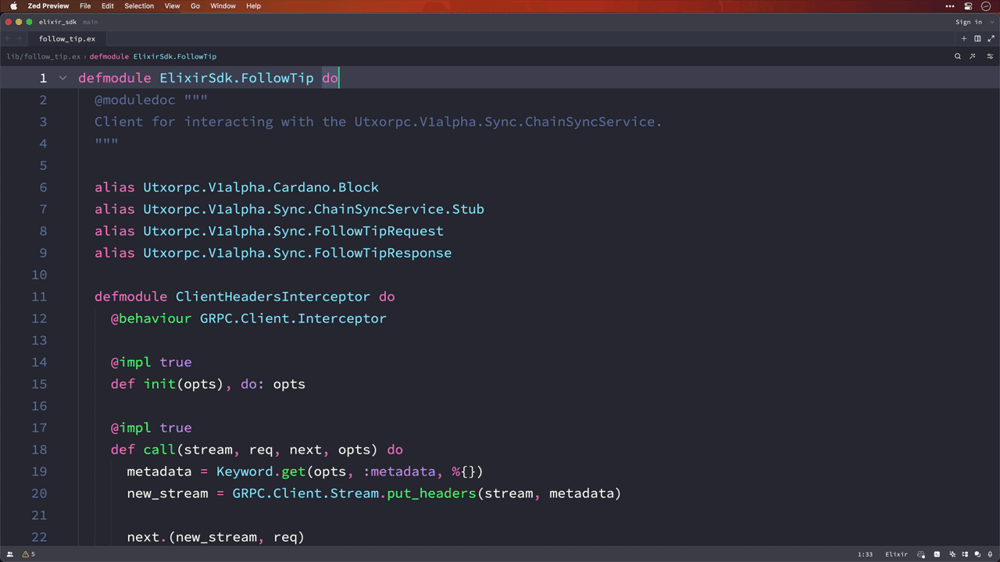

# Elixir SDK

Elixir UTxO RPC SDK



## Running

Clone the repo and fetch [its submodule](https://github.com/utxorpc/spec) with the followign command:

```
git clone --recurse-submodules http://github.com/wowica/elixir-sdk
```

The follow tip example can be run with the following command:

```
API_KEY="your-demeter-api-key" mix run -e "ElixirSdk.UtxorpcClient.follow_tip"
```

## Development

To re-generate Elixir files from proto files, run `./bin/generate.sh`. The Elixir generated files should be under `lib/utxorpc`. These should not be changed manually.
